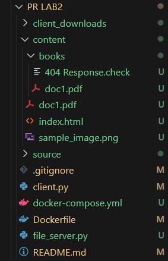
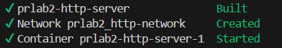
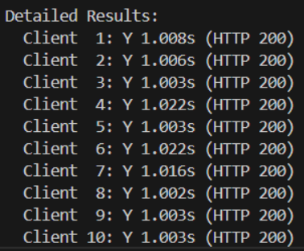
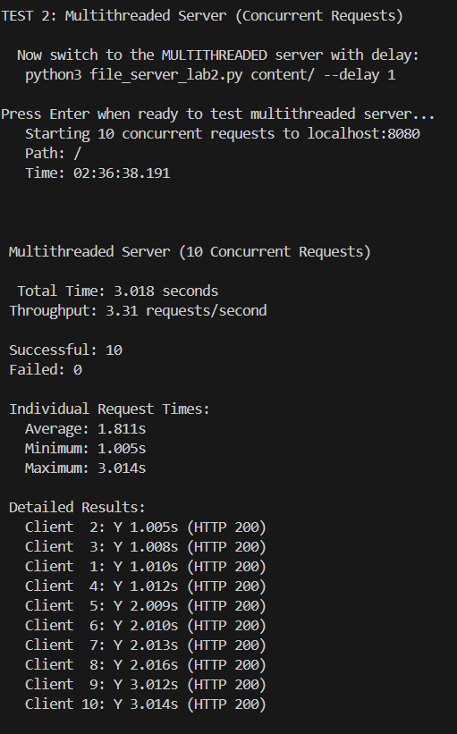

# HTTP File Server with Docker
## PR LAB 2
## Tatarintev Denis - FAF-232

A lightweight HTTP file server implementation with Docker containerization. This server handles GET requests to serve HTML, PNG, and PDF files, along with automatic directory listing.

## Building and Running with Docker

Here's the step-by-step process of building and running the Docker container:




## Testing File Server Functionality

The file server was tested across different devices on the local network, demonstrating support for various file types:

### HTML Page Access


### File Download Script + 404 Response


## Server Features

### Directory Listing

When a directory is requested, the server generates an HTML page with:
- Links to all files and subdirectories
- Navigation to parent directory
- Visual distinction between files and directories

### Error Handling

404 response - error was presented on previous screenshot

## Usage Instructions

### Running the Server

```bash
# Using Python 
python file_server.py content/

# Using Docker
docker-compose up --build -d
```

The server will listen on port 8080 by default.

### HTTP Client Usage

The included HTTP client allows for simple file downloads:

```bash
# Syntax
python client.py <host> <port> <resource> <save_directory>

# Examples
python client.py localhost 8080 /index.html client_downloads/
python client.py localhost 8080 /content/sample_image.png client_downloads/
python client.py localhost 8080 /content/doc1.pdf client_downloads/
```

## Network Sharing

To share your server with friends on a local network:

1. Find your local IP address:
   ```powershell
   ipconfig
   ```

2. Share the URL with your friends:
   ```
   http://YOUR_IP:8080/
   ```

3. Friends can use the client to download files:
   ```bash
   python client.py YOUR_IP 8080 /index.html client_downloads/
   ```