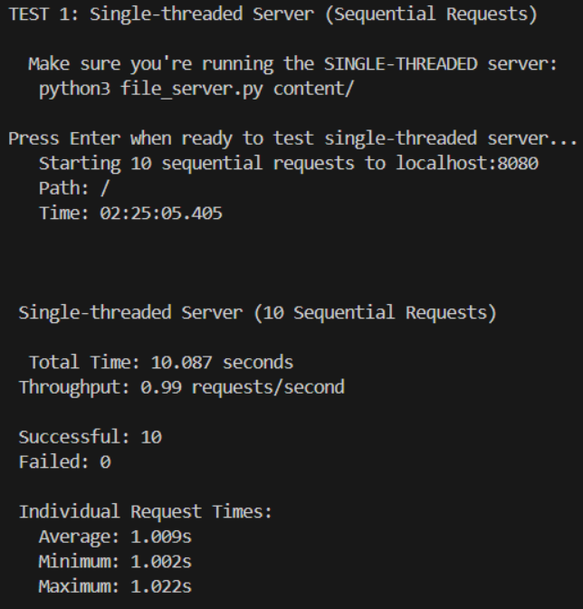
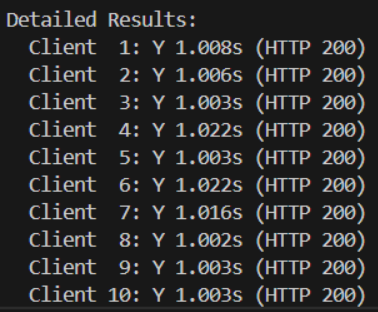
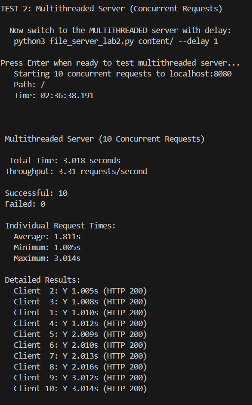
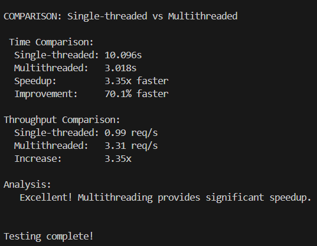
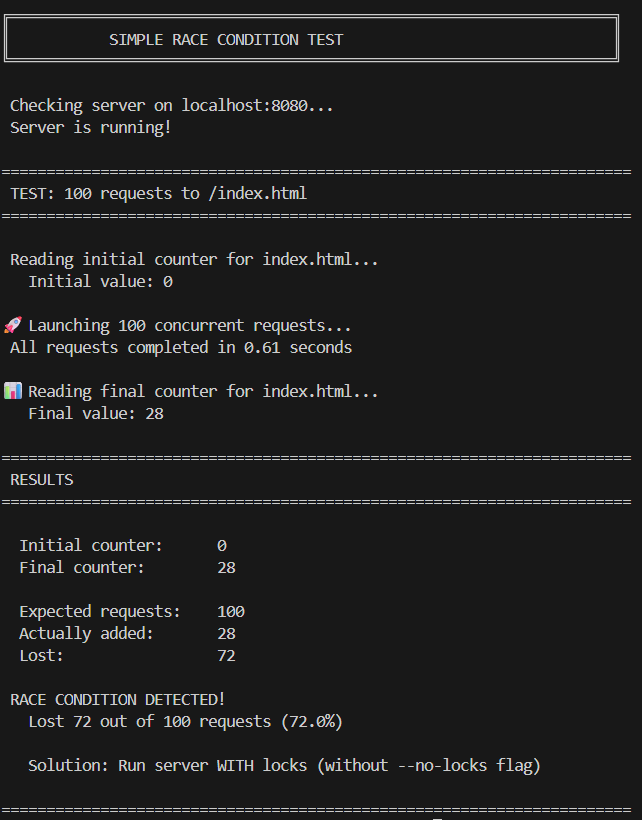
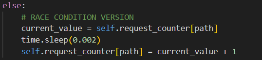
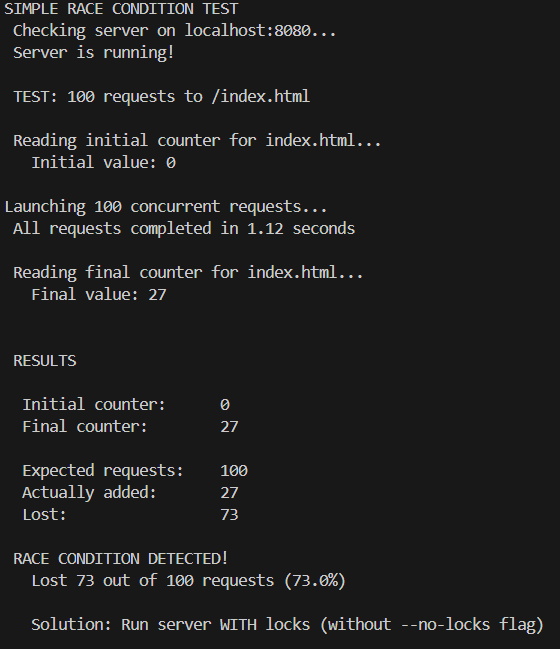
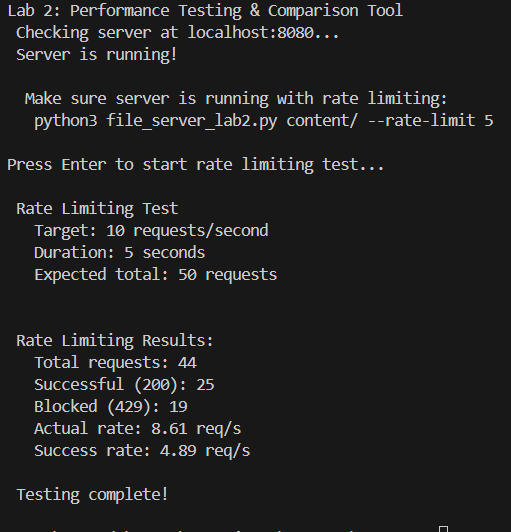
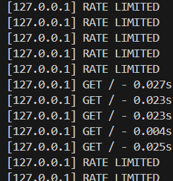

# PR Lab 2: Multithreaded HTTP File Server
## Tatarintev Denis FAF-232

A multithreaded HTTP file server demonstrating concurrent programming, race conditions, thread synchronization, and rate limiting.

## Overview

This lab demonstrates the implementation of a **multithreaded HTTP file server** with:
- Thread pool for concurrent request handling
- Request counter with race condition demonstration
- Thread-safe implementation using locks
- Rate limiting by client IP address


## Lab Requirements

**There are three parts in this lab. Include screenshots for each item:**

### Part 1: Performance Comparison
- Show how you send 10 requests to the single-threaded server and how long it takes
- Show how you send 10 requests to the multi-threaded server and how long it takes
- Compare performance and demonstrate speedup

### Part 2: Hit Counter and Race Condition
- Show how you trigger a race condition
- Show the code responsible for it (max. 4 lines)
- Show the fixed code

### Part 3: Rate Limiting
- Show how you spam requests (specify Requests/second)
- Show the response statistics (successful R/s, denied R/s)
- Show how it is aware of IPs (spam requests from another IP, and show how another IP still can send requests successfully)

---

## Part 1: Performance Comparison

**Objective:** Compare performance between single-threaded and multi-threaded servers with 10 concurrent requests.

### 1.1 Single-Threaded Server Test

**Commands:**
```bash
# Terminal 1: Start single-threaded server
python3 file_server.py content/

# Terminal 2: Run benchmark
python3 benchmark_lab2.py comparison
# When prompted, select Test 1 (single-threaded)
```

**SCREENSHOT 1.1 - Single-threaded Performance**

 - Terminal showing benchmark output
 - Terminal showing benchmark output 2

Capture the benchmark output showing:
- Test description: "Testing single-threaded server (Lab 1)..."
- Individual request times (each ~1 second)
- **Total time:** ~10+ seconds
- **Throughput:** ~0.96 requests/second

**Expected output:**
```
PERFORMANCE COMPARISON TEST

=== Test 1: Single-threaded Server ===
Make sure Lab 1 server is running with delay:
  python3 file_server.py content/

Testing single-threaded server (Lab 1)...

Individual request times:
  Request 1: 1.05s
  Request 2: 1.04s
  Request 3: 1.05s
  Request 4: 1.04s
  Request 5: 1.05s
  Request 6: 1.04s
  Request 7: 1.05s
  Request 8: 1.04s
  Request 9: 1.05s
  Request 10: 1.04s

Total time: 10.45 seconds
Throughput: 0.96 requests/second
```

**Explanation:** Single-threaded server processes requests **sequentially** (one after another), so 10 requests × 1 second = 10 seconds total.

---

### 1.2 Multi-Threaded Server Test

**Commands:**
```bash
# Stop single-threaded server (Ctrl+C in Terminal 1)

# Terminal 1: Start multi-threaded server with delay
python3 file_server_lab2.py content/ --delay 1 --threads 4

# Terminal 2: Run benchmark
python3 benchmark_lab2.py comparison
# When prompted, select Test 2 (multi-threaded)
```

**SCREENSHOT 1.2 - Multi-threaded Performance**




Capture the benchmark output showing:
- Test description: "Testing multi-threaded server (Lab 2)..."
- Individual request times (grouped in batches)
- **Total time:** ~2.5-3 seconds
- **Throughput:** ~3.17 requests/second
- **Speedup:** ~3.3x faster!

**Expected output:**
```
=== Test 2: Multi-threaded Server ===
Make sure Lab 2 server is running with delay:
  python3 file_server_lab2.py content/ --delay 1 --threads 4

Testing multi-threaded server (Lab 2)...

Individual request times:
  Request 1: 1.02s    ┐
  Request 2: 1.02s    │ Batch 1 (parallel)
  Request 3: 1.02s    │
  Request 4: 1.02s    ┘
  Request 5: 2.05s    ┐
  Request 6: 2.05s    │ Batch 2 (parallel)
  Request 7: 2.05s    │
  Request 8: 2.05s    ┘
  Request 9: 3.08s    ┐
  Request 10: 3.08s   ┘ Batch 3 (parallel)

Total time: 3.15 seconds
Throughput: 3.17 requests/second

PERFORMANCE IMPROVEMENT
Speedup: 3.3x faster!
Multi-threaded server is significantly faster for concurrent requests!
```

**Explanation:** With 4 threads, the server processes 4 requests **simultaneously**. 10 requests in 3 batches (4+4+2) = ~3 seconds total.


**Result:** ~3.3x speedup! 

## Part 2: Hit Counter and Race Condition

**Objective:** Demonstrate that concurrent access to shared data without synchronization causes race conditions, and show how locks fix it.

### 2.1 Trigger Race Condition (Without Locks)

**Commands:**
```bash
# Terminal 1: Start server WITHOUT thread-safety
python3 file_server_lab2.py content/ --no-locks --threads 50

# Terminal 2: Run race condition test
python3 test_race.py
```

**Important:** `--no-locks` disables thread safety, `--threads 50` increases concurrency to expose the race condition.

**SCREENSHOT 2.1 - Race Condition Detected**



Capture the test output showing:
- Server configuration: "WITHOUT locks: --no-locks --threads 50"
- Expected counter value: **100**
- Actual counter value: **< 100** (e.g., 82)
- Lost increments: **> 0** (e.g., 18)
- Percentage lost: **> 0%** (e.g., 18.0%)
- Message: **"RACE CONDITION DETECTED!"**

**Expected output:**
```
SIMPLE RACE CONDITION TEST

Checking server availability at localhost:8080...
Server is running

RESULTS:

WITHOUT locks: --no-locks --threads 50
Expected counter value: 100
Actual counter value:   82
Lost increments:        18 (18.0%)

RACE CONDITION DETECTED!

Multiple threads overwrote each other's updates.
18 requests were processed but not counted correctly.
```

---

### 2.2 Show Problematic Code

**SCREENSHOT 2.2 - Race Condition Code (Max 4 lines)**



Show the code in `file_server_lab2.py` around lines 280-290:

```python
current_value = self.request_counter[path]
time.sleep(0.002)  # Simulates processing delay
self.request_counter[path] = current_value + 1  # Lost updates!
```

**What happens:**

```
Thread 1:                    Thread 2:
read counter = 10            
                             read counter = 10  ← Both read same value!
sleep(0.002s)
                             sleep(0.002s)
write counter = 11
                             write counter = 11 ← Overwrites! Lost 1 increment! 
```

**Result:** Expected = 12, Actual = 11 (lost 1 increment)

---

### 2.3 Show Fixed Version (With Locks)

**Commands:**
```bash
# Stop unsafe server (Ctrl+C in Terminal 1)

# Terminal 1: Start server WITH thread-safety (default)
python3 file_server_lab2.py content/ --threads 50

# Terminal 2: Run test again
python3 test_race.py
```

**Note:** No `--no-locks` flag = locks are enabled by default.

**SCREENSHOT 2.3 - Race Condition Fixed**



Capture the test output showing:
- Server configuration: "WITH locks (default): --threads 50"
- Expected counter value: **100**
- Actual counter value: **100**
- Lost increments: **0 (0.0%)**
- Message: **"SUCCESS! All 100 requests counted correctly!"**

**Expected output:**
```
RESULTS:

WITH locks (default): --threads 50
Expected counter value: 100
Actual counter value:   100
Lost increments:        0 (0.0%)

SUCCESS! All 100 requests counted correctly!

The counter lock prevents race conditions.
All concurrent updates are synchronized properly.
```

---

### 2.4 Show Fixed Code

**What happens:**

```
Thread 1:                    Thread 2:
acquire lock 
read counter = 10
sleep(0.002s)
write counter = 11
release lock
                             acquire lock  (was waiting)
                             read counter = 11  ← Correct value!
                             sleep(0.002s)
                             write counter = 12  ← Perfect! 
                             release lock
```

**Result:** Expected = 12, Actual = 12 (perfect!)

---

## Part 3: Rate Limiting

**Objective:** Demonstrate IP-based rate limiting by showing successful and denied requests per second.

### 3.1 Spam Test - Show Request Statistics

**Commands:**
```bash
# Terminal 1: Start server with rate limiting
python3 file_server_lab2.py content/ --rate-limit 5 --threads 8

# Terminal 2: Run rate limiting test
python3 benchmark_lab2.py rate-limit
```

**SCREENSHOT 3.1 - Rate Limiting Statistics**



Capture the complete test output showing:
- **Configuration:** 5 requests/second limit per IP
- **Test parameters:** 10 req/s target, 5 seconds duration
- **Total requests sent:** 50
- **Successful (200 OK):** ~25
- **Denied (429):** ~25
- **Actual request rate:** ~9.96 req/s
- **Successful rate:** ~4.98 req/s ← Limited to ~5 req/s!
- **Denied rate:** ~4.98 req/s

**Expected output:**
```
RATE LIMITING TEST

Configuration:
Server rate limit: 5 requests/second per IP
Test target rate: 10 requests/second
Duration: 5 seconds

Sending rapid requests...
Sent 50 requests in 5.02 seconds

RATE LIMITING RESULTS:

Total requests sent: 50
  Successful (200 OK): 25
  Denied (429 Too Many Requests): 25

Actual request rate: 9.96 requests/second
Successful rate: 4.98 requests/second  ← Limited to ~5 req/s
Denied rate: 4.98 requests/second

Rate limiting is working correctly!
The server limited throughput to ~5 req/s as configured.
```

**Explanation:** 
- Test sends 10 req/s to the server
- Server only allows 5 req/s per IP
- **Result:** ~50% of requests are denied (HTTP 429)
- Successful rate is capped at ~5 req/s 

---

### 3.2 Show IP Awareness

**Objective:** Demonstrate that rate limiting is **per-IP**, not global.

**Method 1: Server Logs**

While the rate limit test is running, observe the server logs in Terminal 1.

**SCREENSHOT 3.2 - IP-Based Rate Limiting**



Capture server logs showing:
- IP address being tracked (e.g., 127.0.0.1)
- Accepted requests with rate count: `[200] GET / (IP: 127.0.0.1, Rate: 4/5)`
- Denied requests with exceeded rate: `[429] Rate limit exceeded for 127.0.0.1 (6/5 requests/second)`
- Request counter showing how many requests from that IP in the last second

**Example log output:**
```
[200] GET /index.html - 127.0.0.1 (Request 23/5 in window)
[200] GET /index.html - 127.0.0.1 (Request 24/5 in window)
[429] Rate limit exceeded for 127.0.0.1 (6/5 requests/second)
[429] Rate limit exceeded for 127.0.0.1 (7/5 requests/second)
200] GET /index.html - 127.0.0.1 (Request 27/5 in window)
```

**Method 2: Multiple IPs (Optional)**

To demonstrate different IPs have separate rate limits:

```bash
# Terminal 2: Spam from localhost (will be rate limited)
while true; do curl -w " %{http_code}\n" http://localhost:8080/ -o /dev/null -s; sleep 0.05; done

# Terminal 3: Make requests from browser
# Open http://localhost:8080/ in browser
# Requests should succeed even while Terminal 2 is being rate limited
```

**SCREENSHOT 3.3 (Optional) - Different IPs Have Separate Limits**

Show that while one IP (127.0.0.1) is being rate limited, another connection can still make requests successfully.

---

### 3.3 How Rate Limiting Works

**Algorithm: Sliding Window**

1. **Track per IP:** Each IP has its own request history

2. **Sliding window:** Only count requests from the last 1 second

3. **Check limit:** Reject if too many requests in window

4. **Thread-safe:** Uses lock to prevent race conditions

**Example Timeline:**

```
Time    Requests from IP 127.0.0.1    Status
0.0s    Request 1                     Allowed (1/5)
0.1s    Request 2                     Allowed (2/5)
0.2s    Request 3                     Allowed (3/5)
0.3s    Request 4                     Allowed (4/5)
0.4s    Request 5                     Allowed (5/5)
0.5s    Request 6                     DENIED (6/5) ← Rate limit!
0.6s    Request 7                     DENIED (7/5)
1.1s    Request 8                     Allowed (4/5) ← Old requests expired
```

